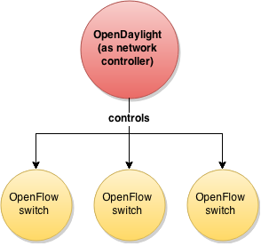
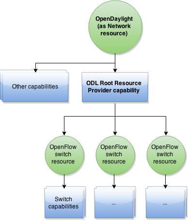

This extension integrates [OpenDaylight](http://www.opendaylight.org/) as network controller, in its `Helium` version.

Modules
=======
The ODL extension is composed by three modules: `client`, `model` and `capabillities`.

First module, [client](./client/), implements REST clients for some OpenDaylight APIs: Node and Node Connector Northbound REST API (based on [source code](https://github.com/opendaylight/controller/blob/stable/helium/opendaylight/northbound/switchmanager/src/main/java/org/opendaylight/controller/switchmanager/northbound/SwitchNorthbound.java)), Flow Configuration Northbound (based on [source code](https://github.com/opendaylight/controller/blob/stable/helium/opendaylight/northbound/flowprogrammer/src/main/java/org/opendaylight/controller/flowprogrammer/northbound/FlowProgrammerNorthbound.java)) and Topology Northbound REST API (based on [source code](https://github.com/opendaylight/controller/blob/stable/helium/opendaylight/northbound/topology/src/main/java/org/opendaylight/controller/topology/northbound/TopologyNorthboundJAXRS.java)).

Second module, [model](./model/), contains common data model classes used by the rest of the components, including clients and capabilities.

Finally, [capabilities](./capabilities/) module contains capability implementations, including [Flow Management capability definition](./capabilities/src/main/java/org/mqnaas/extensions/odl/capabilities/flows/IFlowManagement.java) and its [implementation](./capabilities/src/main/java/org/mqnaas/extensions/odl/capabilities/flows/ODLFlowManagement.java) and [ODL Root Resource Provider capability implementation](./capabilities/impl/ODLRootResourceProvider.java).

Resource-capability concepts
============================

Capabilities (and its services) defined in these bundles are intended to be used in resources of type `Network` of model `odl` (OpenDaylight). Moreover, here OpenDaylight is understood as a network controller composed by OpenFlow switches, this means that any switch resource controlled by OpenDaylight will be, in MQNaaS, a subresource of the network resource. This diagram shows MQNaaS conceptual representation of OpenDaylight and the switches that controls:



The abstraction that MQNaaS constructs using its concepts (resource, capability and service) is represented by this diagram:



Using the REST API
==================

It is possible to use the MQNaaS REST API in order to interact with ODL network resource instances.

 A quick way to test these capabilities is using OpenDaylight Helium and Mininet. [This guide](TODO_link) shows a basic setup without any extra equipment requirement.

Once an OpenDayligth instance is available, MQNaaS can be executed and required Apache Karaf features can be installed. In a Karaf shell, execute these commands (in this case `0.0.1-SNAPSHOT` version is used):

  ```
  feature:repo-add mvn:org.mqnaas.extensions/odl/0.0.1-SNAPSHOT/xml/features
  feature:install odl
  ```

Create OpenDaylight resource
----------------------------------

First of all, it is necessary creating an OpendDaylight resource (type `network`, model `odl`). For this purpose, Root Resource Administration capability should be used. This example REST call creates it:

  PUT http://{MQNaaS_host}:{MQNaaS_port}/mqnaas/IRootResourceAdministration/
  
  
  Content-Type: application/xml
  
  ```xml
  <?xml version="1.0" encoding="UTF-8" standalone="yes"?>
  <ns2:rootResourceDescriptor xmlns:ns2="org.mqnaas">
      <specification>
          <type>NETWORK</type>
          <model>odl</model>
      </specification>
      <endpoints>
       <endpoint><uri>http://{OpenDaylight_host}:{OpenDaylight_port}</uri></endpoint>
      </endpoints>
  	<credentials xsi:type="usernamePasswordCredentials"
  	        xmlns:xsi="http://www.w3.org/2001/XMLSchema-instance">
        <username>admin</username>
        <password>admin</password>
      </credentials>
  </ns2:rootResourceDescriptor>
  ```
  Use proper properties:
  
  * _{MQNaaS_host}_: host name or IP address of the MQNaaS instance
  * _{MQNaaS_port}_: TCP port where the MQNaaS is listening
  * _{OpenDaylight_host}_: host name or IP address of the OpenDaylight instance
  * _{OpenDaylight_port}_: TCP port where the OpenDaylight is listening
  
  With expected response:
  
  200 OK
  
  ```
  Network-odl-2
  ```
  
  The body of the response contains the OpenDaylight resource ID in MQNaaS (in this case _Network-odl-2_).
  
Obtain switches of the OpenDaylight network resource
----------------------------------------------------

Once the resource is created, it is possible to call its capabilities. As a network resource has subresources, in order to manage them, Root Resource Provider capability should be used. To obtain switches as subresources of parent OpenDaylight network resource use this call:

  GET http://{MQNaaS_host}:{MQNaaS_port}/mqnaas/IRootResourceAdministration/Network-odl-2/IRootResourceProvider
  
  With this expected response (containing in this case, 3 switch resources):
  
  ```xml
  <IRootResource>
      <IRootResourceId>OFSwitch-3</IRootResourceId>
      <IRootResourceId>OFSwitch-4</IRootResourceId>
      <IRootResourceId>OFSwitch-5</IRootResourceId>
  </IRootResource>
  ```
  
It is possible to obtain extra information about any resource in MQNaaS. Specifically, it is useful when there are real devices associated with it. For this purpose, there is a capability called Attribute Store. For instance, it is possible to obtain the ID assigned to switch by OpenDaylight (_resource.external.id_ internally) with this call:

  GET http://{MQNaaS_host}:{MQNaaS_port}/mqnaas/IRootResourceAdministration/Network-odl-2/IRootResourceProvider/OFSwitch-3/IAttributeStore/attribute?arg0=resource.external.id
  
  With this expected response (containing in this case, the ID of switch _OFSwitch-3_ in the OpenDaylight network _Network-odl-2_):
  
  ```
  00:00:00:00:00:00:00:02
  ```

Obtain ports of a switch resource
---------------------------------

Each switch has ports as subresources. To obtain subresource ports of a given switch resource, it is necessary to use its Port Management capability, using this call (in this case, _Network-odl-2_ as OpenDaylight network resource and _OFSwitch-3_ switch resource):

  GET http://{MQNaaS_host}:{MQNaaS_port}/mqnaas/IRootResourceAdministration/Network-odl-2/IRootResourceProvider/OFSwitch-3/IPortManagement
  
  With this expected response (containing in this case, 4 port resources):
  
  ```xml
  <IResource>
    <IResourceId>port-1</IResourceId>
    <IResourceId>port-2</IResourceId>
    <IResourceId>port-3</IResourceId>
    <IResourceId>port-4</IResourceId>
  </IResource>
  ```
  
  In this case, there are 4 ports.
  
Once again, it is possible obtaining internal port ID assigned by OpenDaylight with Attribute Store capability. This call shows it (in this case, _Network-odl-2_ as OpenDaylight network resource, _OFSwitch-3_ switch resource, and _port-4_ port resource):

  GET http://{MQNaaS_host}:{MQNaaS_port}/mqnaas/IRootResourceAdministration/Network-odl-2/IRootResourceProvider/OFSwitch-3/IPortManagement/port-4/IAttributeStore/attribute?arg0=resource.external.id
  
   With this expected response:
  
  ```
  2
  ```
  
  This means that _port-4_ of _OFSwitch-3_ resource in MQNaaS has ID _2_ in OpenDaylight.
  
  Moreover, it is possible obtaining the port name assigned in OpenFlow using the Attribute Store capability argument _resource.external.name_ (instead of _resource.external.id_). In the example, it is _s2_ using same REST call, changing the corresponding argument.